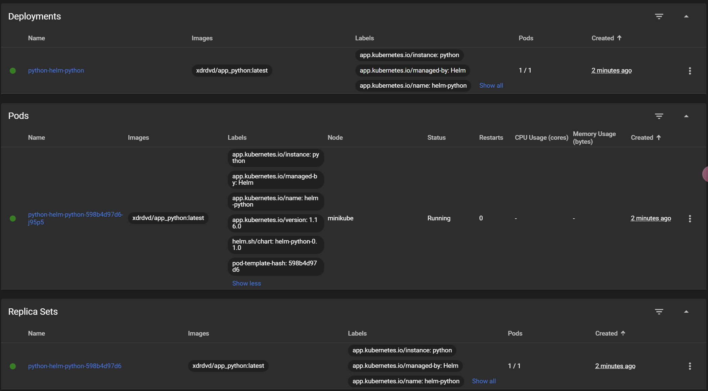
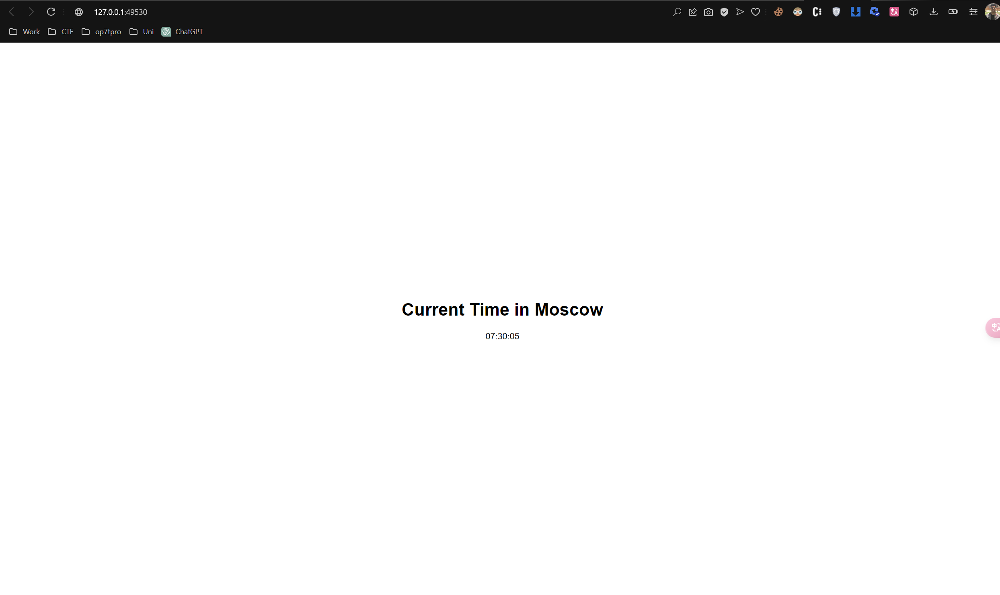

## Task 1

### helm install python helm-python/
```
NAME: python
LAST DEPLOYED: Thu Apr 10 07:00:14 2024
NAMESPACE: default
STATUS: deployed
REVISION: 1
NOTES:
1. Get the application URL by running these commands:
     NOTE: It may take a few minutes for the LoadBalancer IP to be available.
           You can watch the status of by running 'kubectl get --namespace default svc -w python-helm-python'
  export SERVICE_IP=$(kubectl get svc --namespace default python-helm-python --template "{{ range (index .status.loadBalancer.ingress 0) }}{{.}}{{ end }}")
  echo http://$SERVICE_IP:5000
```



### minikube service python-helm-python
```
|-----------|--------------------|-------------|---------------------------|
| NAMESPACE |        NAME        | TARGET PORT |            URL            |
|-----------|--------------------|-------------|---------------------------|
| default   | python-helm-python | http/5000   | http://192.168.49.2:31380 |
|-----------|--------------------|-------------|---------------------------|
🏃  Starting tunnel for service python-helm-python.
|-----------|--------------------|-------------|------------------------|
| NAMESPACE |        NAME        | TARGET PORT |          URL           |
|-----------|--------------------|-------------|------------------------|
| default   | python-helm-python |             | http://127.0.0.1:49530 |
|-----------|--------------------|-------------|------------------------|
🎉  Opening service default/python-helm-python in default browser...
❗  Because you are using a Docker driver on windows, the terminal needs to be open to run it.
```




### kubectl get pods,svc
```
NAME                                      READY   STATUS    RESTARTS   AGE
pod/python-helm-python-598b4d97d6-j95p5   1/1     Running   0          6m36s

NAME                         TYPE           CLUSTER-IP      EXTERNAL-IP   PORT(S)          AGE
service/kubernetes           ClusterIP      10.96.0.1       <none>        443/TCP          13d
service/python-helm-python   LoadBalancer   10.104.201.76   <pending>     5000:31380/TCP   6m36s
```


## Task 2

### helm lint helm-python
```
==> Linting helm-python
[INFO] Chart.yaml: icon is recommended

1 chart(s) linted, 0 chart(s) failed
```

### helm install --dry-run helm-hooks helm-python
```
NAME: helm-hooks
LAST DEPLOYED: Thu Apr 10 07:30:20 2024
NAMESPACE: default
STATUS: pending-install
REVISION: 1
HOOKS:
---
# Source: helm-python/templates/post-install-hook.yml
apiVersion: v1
kind: Pod
metadata:
   name: postinstall-hook
   annotations:
       "helm.sh/hook": "post-install"
       "helm.sh/hook-delete-policy": hook-succeeded
spec:
  containers:
  - name: post-install-container
    image: busybox
    imagePullPolicy: Always
    command: ['sh', '-c', 'echo The post-install hook is running && sleep 20' ]
  restartPolicy: Never
  terminationGracePeriodSeconds: 0
---
# Source: helm-python/templates/pre-install-hook.yml
apiVersion: v1
kind: Pod
metadata:
   name: preinstall-hook
   annotations:
       "helm.sh/hook": "pre-install"
       "helm.sh/hook-delete-policy": hook-succeeded
spec:
  containers:
  - name: pre-install-container
    image: busybox
    imagePullPolicy: IfNotPresent
    command: ['sh', '-c', 'echo The pre-install hook is running && sleep 20' ]
  restartPolicy: Never
  terminationGracePeriodSeconds: 0
---
# Source: helm-python/templates/tests/test-connection.yaml
apiVersion: v1
kind: Pod
metadata:
  name: "helm-hooks-helm-python-test-connection"
  labels:
    helm.sh/chart: helm-python-0.1.0
    app.kubernetes.io/name: helm-python
    app.kubernetes.io/instance: helm-hooks
    app.kubernetes.io/version: "1.16.0"
    app.kubernetes.io/managed-by: Helm
  annotations:
    "helm.sh/hook": test
spec:
  containers:
    - name: wget
      image: busybox
      command: ['wget']
      args: ['helm-hooks-helm-python:5000']
  restartPolicy: Never
MANIFEST:
---
# Source: helm-python/templates/serviceaccount.yaml
apiVersion: v1
kind: ServiceAccount
metadata:
  name: helm-hooks-helm-python
  labels:
    helm.sh/chart: helm-python-0.1.0
    app.kubernetes.io/name: helm-python
    app.kubernetes.io/instance: helm-hooks
    app.kubernetes.io/version: "1.16.0"
    app.kubernetes.io/managed-by: Helm
automountServiceAccountToken: true
---
# Source: helm-python/templates/service.yaml
apiVersion: v1
kind: Service
metadata:
  name: helm-hooks-helm-python
  labels:
    helm.sh/chart: helm-python-0.1.0
    app.kubernetes.io/name: helm-python
    app.kubernetes.io/instance: helm-hooks
    app.kubernetes.io/version: "1.16.0"
    app.kubernetes.io/managed-by: Helm
spec:
  type: LoadBalancer
  ports:
    - port: 5000
      targetPort: http
      protocol: TCP
      name: http
  selector:
    app.kubernetes.io/name: helm-python
    app.kubernetes.io/instance: helm-hooks
---
# Source: helm-python/templates/deployment.yaml
apiVersion: apps/v1
kind: Deployment
metadata:
  name: helm-hooks-helm-python
  labels:
    helm.sh/chart: helm-python-0.1.0
    app.kubernetes.io/name: helm-python
    app.kubernetes.io/instance: helm-hooks
    app.kubernetes.io/version: "1.16.0"
    app.kubernetes.io/managed-by: Helm
spec:
  replicas: 1
  selector:
    matchLabels:
      app.kubernetes.io/name: helm-python
      app.kubernetes.io/instance: helm-hooks
  template:
    metadata:
      labels:
        helm.sh/chart: helm-python-0.1.0
        app.kubernetes.io/name: helm-python
        app.kubernetes.io/instance: helm-hooks
        app.kubernetes.io/version: "1.16.0"
        app.kubernetes.io/managed-by: Helm
    spec:
      serviceAccountName: helm-hooks-helm-python
      securityContext:
        {}
      containers:
        - name: helm-python
          securityContext:
            {}
          image: "xdrdvd/app_python:latest"
          imagePullPolicy: Always
          ports:
            - name: http
              containerPort: 5000
              protocol: TCP
          # livenessProbe:
          #   httpGet:
          #     path: /
          #     port: http
          # readinessProbe:
          #   httpGet:
          #     path: /
          #     port: http
          resources:
            {}

NOTES:
1. Get the application URL by running these commands:
     NOTE: It may take a few minutes for the LoadBalancer IP to be available.
           You can watch the status of by running 'kubectl get --namespace default svc -w helm-hooks-helm-python'
  export SERVICE_IP=$(kubectl get svc --namespace default helm-hooks-helm-python --template "{{ range (index .status.loadBalancer.ingress 0) }}{{.}}{{ end }}")
  echo http://$SERVICE_IP:5000
```
### helm install helm-hooks helm-python
```
NAME: helm-hooks
LAST DEPLOYED: Thu Apr 10 07:35:20 2024
NAMESPACE: default
STATUS: deployed
REVISION: 1
NOTES:
1. Get the application URL by running these commands:
     NOTE: It may take a few minutes for the LoadBalancer IP to be available.
           You can watch the status of by running 'kubectl get --namespace default svc -w helm-hooks-helm-python'
  export SERVICE_IP=$(kubectl get svc --namespace default helm-hooks-helm-python --template "{{ range (index .status.loadBalancer.ingress 0) }}{{.}}{{ end }}")
  echo http://$SERVICE_IP:5000
```

### kubectl get pods
```
NAME                                      READY   STATUS    RESTARTS   AGE
helm-hooks-helm-python-5d9b746d7f-wttc8   1/1     Running   0          50s
python-helm-python-598b4d97d6-j95p5       1/1     Running   0          13m
```

### kubectl describe pod preinstall-hook
```
Name:             preinstall-hook
Namespace:        default
Priority:         0
Service Account:  default
Node:             minikube/192.168.49.2
Start Time:       Thu, 10 Apr 2024 07:42:33 +0300
Labels:           <none>
Annotations:      helm.sh/hook: pre-install
                  helm.sh/hook-delete-policy: hook-succeeded
Status:           Running
IP:               10.244.0.39
IPs:
  IP:  10.244.0.39
Containers:
  pre-install-container:
    Container ID:  docker://b3959f3de80ba179607cbf1574cf1a71f6755cdc5773befc301d477dc7aa8c90
    Image:         busybox
    Image ID:      docker-pullable://busybox@sha256:c3839dd800b9eb7603340509769c43e146a74c63dca3045a8e7dc8ee07e53966
    Port:          <none>
    Host Port:     <none>
    Command:
      sh
      -c
      echo The pre-install hook is running && sleep 20
    State:          Running
      Started:      Thu, 10 Apr 2024 07:42:34 +0300
    Ready:          True
    Restart Count:  0
    Environment:    <none>
    Mounts:
      /var/run/secrets/kubernetes.io/serviceaccount from kube-api-access-7x86r (ro)
Conditions:
  Type              Status
  Initialized       True
  Ready             True
  ContainersReady   True
  PodScheduled      True
Volumes:
  kube-api-access-7x86r:
    Type:                    Projected (a volume that contains injected data from multiple sources)
    TokenExpirationSeconds:  3607
    ConfigMapName:           kube-root-ca.crt
    ConfigMapOptional:       <nil>
    DownwardAPI:             true
QoS Class:                   BestEffort
Node-Selectors:              <none>
Tolerations:                 node.kubernetes.io/not-ready:NoExecute op=Exists for 300s
                             node.kubernetes.io/unreachable:NoExecute op=Exists for 300s
Events:
  Type    Reason     Age   From               Message
  ----    ------     ----  ----               -------
  Normal  Scheduled  8s    default-scheduler  Successfully assigned default/preinstall-hook to minikube
  Normal  Pulled     7s    kubelet            Container image "busybox" already present on machine
  Normal  Created    7s    kubelet            Created container pre-install-container
  Normal  Started    7s    kubelet            Started container pre-install-container
```

### kubectl describe pod postinstall-hook
```
Name:             postinstall-hook
Namespace:        default
Priority:         0
Service Account:  default
Node:             minikube/192.168.49.2
Start Time:       Thu, 10 Apr 2024 07:45:49 +0300
Labels:           <none>
Annotations:      helm.sh/hook: post-install
                  helm.sh/hook-delete-policy: hook-succeeded
Status:           Running
IP:               10.244.0.44
IPs:
  IP:  10.244.0.44
Containers:
  post-install-container:
    Container ID:  docker://cf3a96911442d752ce359d6c26970eb6d97f5a364200eaef92fcf076e5d35c7e
    Image:         busybox
    Image ID:      docker-pullable://busybox@sha256:c3839dd800b9eb7603340509769c43e146a74c63dca3045a8e7dc8ee07e53966
    Port:          <none>
    Host Port:     <none>
    Command:
      sh
      -c
      echo The post-install hook is running && sleep 20
    State:          Terminated
      Reason:       Completed
      Exit Code:    0
      Started:      Thu, 10 Apr 2024 07:45:53 +0300
      Finished:     Thu, 10 Apr 2024 07:46:13 +0300
    Ready:          False
    Restart Count:  0
    Environment:    <none>
    Mounts:
      /var/run/secrets/kubernetes.io/serviceaccount from kube-api-access-bn5md (ro)
Conditions:
  Type              Status
  Initialized       True
  Ready             False
  ContainersReady   False
  PodScheduled      True
Volumes:
  kube-api-access-bn5md:
    Type:                    Projected (a volume that contains injected data from multiple sources)
    TokenExpirationSeconds:  3607
    ConfigMapName:           kube-root-ca.crt
    ConfigMapOptional:       <nil>
    DownwardAPI:             true
QoS Class:                   BestEffort
Node-Selectors:              <none>
Tolerations:                 node.kubernetes.io/not-ready:NoExecute op=Exists for 300s
                             node.kubernetes.io/unreachable:NoExecute op=Exists for 300s
Events:
  Type    Reason     Age   From               Message
  ----    ------     ----  ----               -------
  Normal  Scheduled  26s   default-scheduler  Successfully assigned default/postinstall-hook to minikube
  Normal  Pulling    26s   kubelet            Pulling image "busybox"
  Normal  Pulled     22s   kubelet            Successfully pulled image "busybox" in 1.484s (3.476s including waiting)
  Normal  Created    22s   kubelet            Created container post-install-container
  Normal  Started    22s   kubelet            Started container post-install-container
```


## Bonus: 

### Helm chart for extra app
[Extra App Chart](helm-go/)

### Create a Library Chart
[Library Chart](library-chart/)
